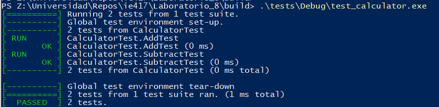
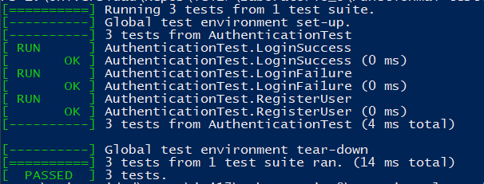
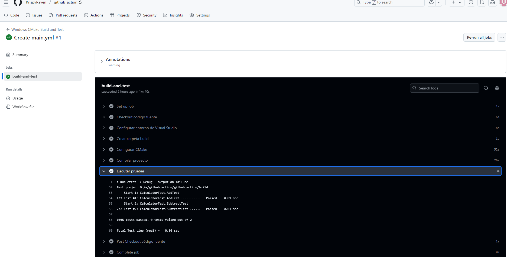

# Resultados de Pruebas de Software

Este documento presenta los resultados de la ejecución de pruebas y configuración descritas en la presentación sobre *Software Testing*.

## 🔧 Infraestructura de GoogleTest

### Estructura del proyecto


Para Calculadora tests
```

/CalculatorTests
├── CMakeLists.txt
├── calculator.h
└── test\_calculator.cpp

````
Para Authenticatio database
```

/Functional Testing
├── CMakeLists.txt
├── authentication.h
├── database.h
├── mock_database.h
└── test\test_authentication.cpp

````
### Compilación y ejecución de tests

```bash
mkdir build
cd build
cmake ..
make
./test_(nombre)
````

### Resultados de ejecución




## ⚙️ CI/CD con GitHub Actions

Se creo un nuevo repositorio ubicado en el siguiente enlace:[Github](https://github.com/KrispyRaven/github_action)


### Archivo de workflow (`.github/workflows/ci-cd.yml`)

```yaml
name: CI/CD Pipeline

on:
  push:
    branches: [ "main" ]
  pull_request:
    branches: [ "main" ]

jobs:
  build:
    runs-on: ubuntu-latest
    steps:
      - uses: actions/checkout@v2
      - name: Set up CMake
        uses: lukka/get-cmake@v3.21.2
      - name: Install dependencies
        run: sudo apt-get install -y build-essential libgtest-dev
      - name: Build and run tests
        run: |
          mkdir build
          cd build
          cmake ..
          make
          ./test_calculator
```

### Resultado del pipeline

Puedes ver los resultados del pipeline en la pestaña **Actions** del repositorio. Todos los jobs deben pasar correctamente:

* ✅ Build exitoso
* ✅ Pruebas ejecutadas correctamente
* ✅ Preparado para despliegue



## 🛠 Herramientas Utilizadas

* Google Test (pruebas unitarias)
* CMake (compilación)

* GitHub Actions (CI/CD)


